<!-- ═══════════════════════════════════════════════════════════════════
     HERO BANNER — Auto-switches dark / light theme
═══════════════════════════════════════════════════════════════════ -->

<picture>
  <source media="(prefers-color-scheme: dark)"  srcset="dark.svg">
  <source media="(prefers-color-scheme: light)" srcset="light.svg">
  
</picture>

 

<!-- ═══════════════════════════════════════════════════════════════════
     TYPING SVG
═══════════════════════════════════════════════════════════════════ -->

 

<!-- ═══════════════════════════════════════════════════════════════════
     SOCIAL BADGES
═══════════════════════════════════════════════════════════════════ -->

 

---

<!-- ═══════════════════════════════════════════════════════════════════
     INTRODUCTION
═══════════════════════════════════════════════════════════════════ -->

# Hi 👋 I'm Mohamed Anas A

### Full Stack Developer · Java Enthusiast · Cloud Learner

I'm a passionate **Full Stack Developer** focused on building scalable, production-grade web applications using **Java**, **Spring Boot**, and **React**. I enjoy designing clean backend architectures, crafting smooth frontend experiences, and deploying cloud-native solutions with **AWS**, **Docker**, and modern DevOps practices.

> *"Code is like poetry — clarity, structure, and elegance matter as much as functionality."*

---

<!-- ═══════════════════════════════════════════════════════════════════
     ABOUT ME
═══════════════════════════════════════════════════════════════════ -->

## 🧑‍💻 About Me

---

<!-- ═══════════════════════════════════════════════════════════════════
     CURRENT FOCUS
═══════════════════════════════════════════════════════════════════ -->

## 🎯 Current Focus

---

<!-- ═══════════════════════════════════════════════════════════════════
     TECH STACK
═══════════════════════════════════════════════════════════════════ -->

## 🛠️ Tech Stack

### 💻 Languages

### 🔙 Backend

### 🎨 Frontend

### 🗄️ Database

### ☁️ Cloud & DevOps

### 🔧 Tools & Platforms

---

<!-- ═══════════════════════════════════════════════════════════════════
     ENGINEERING METRICS
═══════════════════════════════════════════════════════════════════ -->

## ⚡ Engineering Metrics

---

<!-- ═══════════════════════════════════════════════════════════════════
     CONTRIBUTION GRAPH & SNAKE ANIMATION
═══════════════════════════════════════════════════════════════════ -->

## 📈 Contribution Activity

  

<picture>
  <source media="(prefers-color-scheme: dark)" srcset="https://raw.githubusercontent.com/Anas3212/Anas3212/output/github-contribution-grid-snake-dark.svg">
  <source media="(prefers-color-scheme: light)" srcset="https://raw.githubusercontent.com/Anas3212/Anas3212/output/github-contribution-grid-snake.svg">
  
</picture>

---

<!-- ═══════════════════════════════════════════════════════════════════
     DEVELOPER ACHIEVEMENTS
═══════════════════════════════════════════════════════════════════ -->

## 🏆 Developer Achievements

---

<!-- ═══════════════════════════════════════════════════════════════════
     FEATURED PROJECTS
═══════════════════════════════════════════════════════════════════ -->

## 🚀 Featured Projects

<table>
<tr>

<td width="50%">

### 🛒 LocalMart
> A full-stack e-commerce platform for local businesses

**Stack:** `Java` `Spring Boot` `React` `MySQL` `Docker`

- 🏗️ RESTful backend with Spring Boot
- ⚛️ React frontend with cart & checkout
- 🐳 Dockerized deployment
- 🔐 JWT-based authentication

</td>

<td width="50%">

### 🎵 Music Streaming Service
> Spotify-inspired music streaming application

**Stack:** `Java` `Spring Boot` `React` `MySQL` `AWS S3`

- 🎵 Audio streaming with AWS S3
- 📱 Responsive React UI
- 👥 User playlists & favorites
- 🔎 Search & discovery features

</td>

</tr>
<tr>

<td width="50%">

### 🌱 AI Crop Recommendation
> Machine learning system for optimal crop selection

**Stack:** `Python` `Flask` `React` `ML` `MySQL`

- 🤖 ML model for crop prediction
- 🌦️ Weather & soil data integration
- 📊 Analytics dashboard
- 🗺️ Region-based recommendations

</td>

<td width="50%">

### 🧮 Calculator
> Advanced calculator with DevOps pipeline

**Stack:** `HTML` `CSS` `JavaScript` `Docker` `Jenkins`

- 🔢 Scientific calculator functions
- 🐳 Containerized with Docker
- 🔄 CI/CD via Jenkins pipeline
- 📦 Automated build & deploy

</td>

</tr>
</table>

---

<!-- ═══════════════════════════════════════════════════════════════════
     DEV QUOTE & PROFILE VIEWS DASHBOARD
═══════════════════════════════════════════════════════════════════ -->

 

  

⭐ **[Star this repo](https://github.com/Anas3212)** if you found it inspiring · Built with 🖤 and lots of ☕

*Crafted with precision by **Mohamed Anas A** — Last updated 2025*

